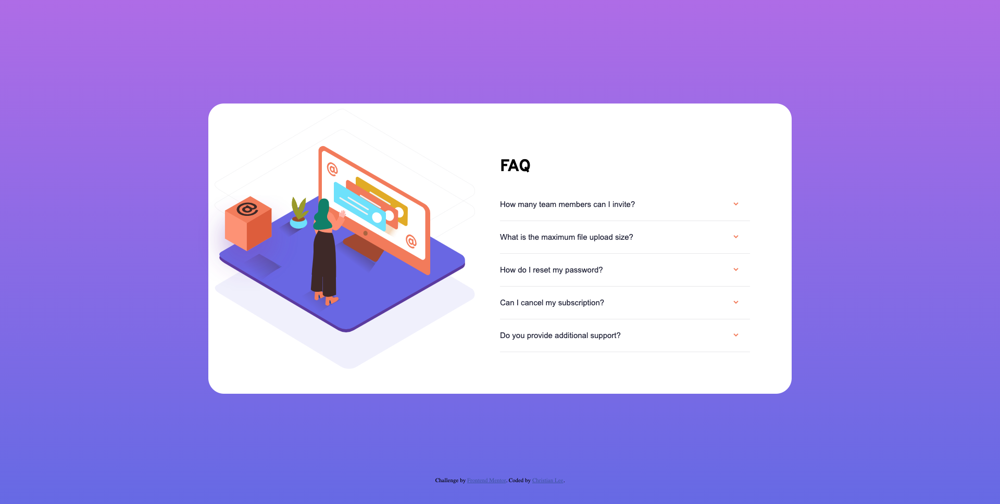

# Frontend Mentor - FAQ accordion card solution

This is a solution to the [FAQ accordion card challenge on Frontend Mentor](https://www.frontendmentor.io/challenges/faq-accordion-card-XlyjD0Oam).

## Table of contents

- [Overview](#overview)
  - [The challenge](#the-challenge)
  - [Screenshot](#screenshot)
  - [Links](#links)
- [My process](#my-process)
  - [Built with](#built-with)
  - [What I learned](#what-i-learned)
  - [Continued development](#continued-development)
- [Author](#author)

## Overview

### The challenge

Users should be able to:

- View the optimal layout for the component depending on their device's screen size
- See hover states for all interactive elements on the page
- Hide/Show the answer to a question when the question is clicked

### Screenshot

### Links

- Live Site URL: [Add live site URL here](https://christian-lee1398.github.io/FAQ-accordian-card/)

## My process

### Built with

- Semantic HTML5 markup
- CSS custom properties
- Flexbox

### What I learned

I'd like to point out that the svgs on Frontend Mentor were positioned in a way that I could not figure out. Instead, I just staggered the images and kept them within the container div instead of the layering in the solution. 

I am also currently trying to find a way to unselect a link when you select a new one. As of right now, you can select all the links and the space gets crowded and unusable on smaller screens.

### Continued development

The logic used in this project (while the code may be messy) I will continue to use for future projects. There's always something to learn with JS, but additionally, I may also play with some more animations when clicking on a link so make the project pop more.

## Author

- Frontend Mentor - [@christian-lee1398](https://www.frontendmentor.io/profile/christian-lee1398)
- GitHub - [@christian-lee1398](https://github.com/christian-lee1398)

